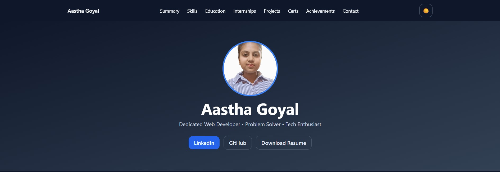
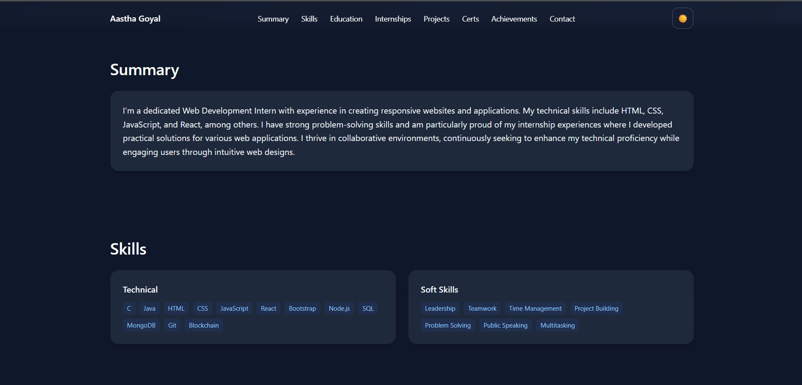
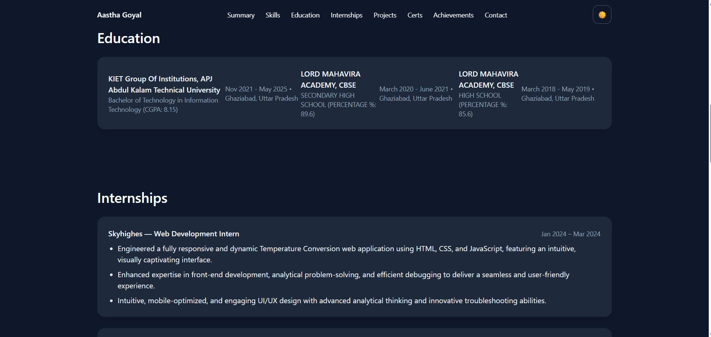
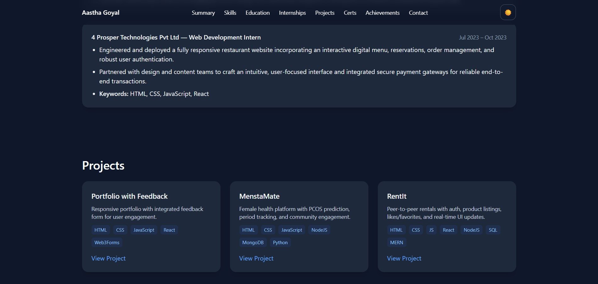
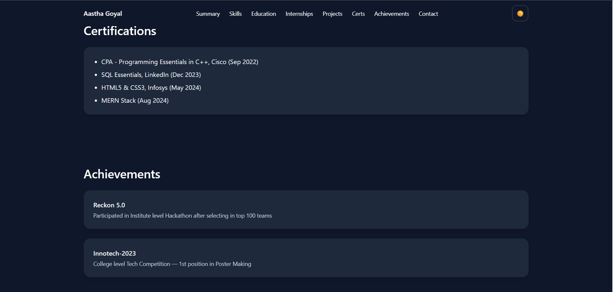

# 🌐 Aastha's Portfolio  

Welcome to my personal portfolio website! 🚀  
This project showcases my skills, projects, and resume in a clean, responsive design.  

## ✨ Features  
- 📱 Fully responsive design  
- 👩‍💻 About Me section  
- 📂 Projects showcase with live demos  
- 📄 Resume download option  
- 📬 Contact form / links to connect  

## 🛠️ Tech Stack  
- **Frontend:** HTML, CSS, JavaScript, React, Vite  
- **Styling:** Modern CSS, Tailwind (if used)  
- **Deployment:** GitHub Pages  

## 🚀 Live Demo  
🔗 [View Portfolio](https://aastha4502.github.io/AasthaPortfolio)  
## 📸 Preview  

  
  
  
  
  

## 📬 Contact  
- **LinkedIn:** [linkedin.com/in/aastha4502](https://linkedin.com/in/aastha4502)  
- **GitHub:** [github.com/aastha4502](https://github.com/aastha4502)  
- **Email:** aasthagoyal1122@gmail.com  

